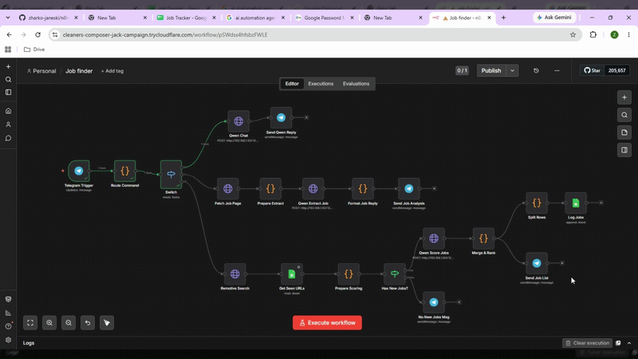
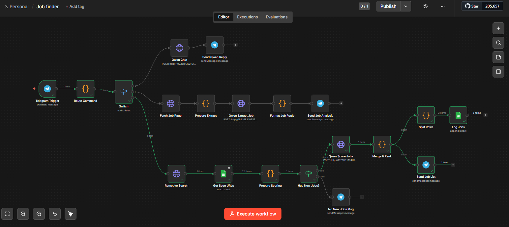
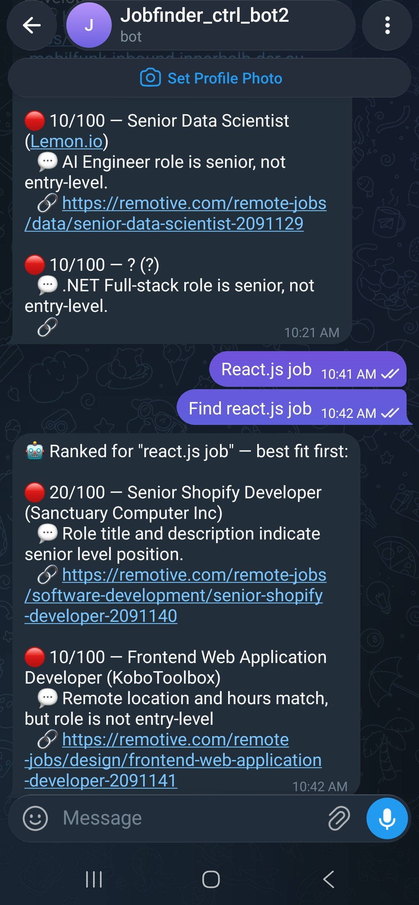
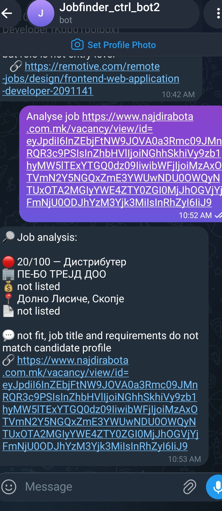
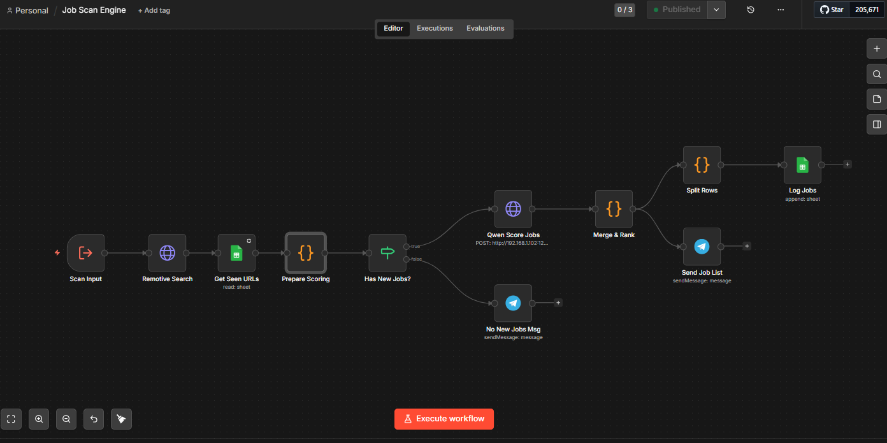
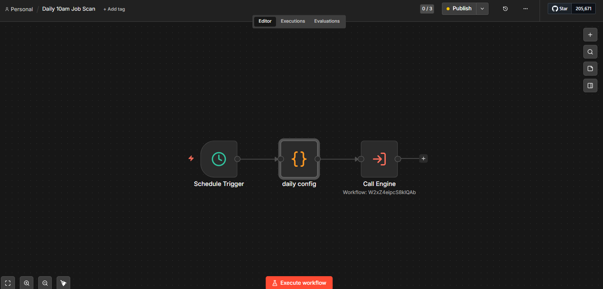

# n8n Job Finder Bot

Telegram-controlled job hunter built with **n8n**. Send a search query, get a ranked list of remote jobs scored by a local AI model. Paste any job URL to get a fit analysis. Every result is logged to Google Sheets, so the same job never comes back twice. A separate scheduler can run the same search engine automatically every morning at 10:00.

---

## Demo

  

The demo shows the Telegram-triggered workflow from input to final job results.

### Workflow Progress

1. **Telegram input received**
2. **Local Qwen model analyzing jobs**
3. **Checking previously seen jobs with Google Sheets**
4. **New jobs logged and results sent to Telegram**

---

## What It Does

- **Telegram remote control** - `find React.js Job` → searches for jobs
- **Job search** - Remotive API provides remote job listings
- **AI scoring** - local Qwen 2.5 7B scores jobs from 0–100 against a defined profile
- **Deduplication** - checks job URLs against the Google Sheets log
- **Ranked results** - 🟢 high / 🟡 medium / 🔴 low priority
- **Job analysis** - paste any job URL → extracts job information and generates a fit analysis
- **Logging** - stores Date, Query, Score, Title, Company, Location, URL, and Reason
- **Daily automation** - the reusable search engine can also be triggered automatically at 10:00

---
## Main Workflow

The main workflow uses Telegram as the interface for interacting with the job-search system.

  

## Telegram Command Routing

Incoming Telegram messages are routed based on the command:

`find <query>` · `job <URL>` · `chat`

### Job Search

**Telegram** → **Route Command** → **Job Scan Engine** → **Remotive API** → **Deduplication** → **Qwen 2.5 7B Scoring** → **Google Sheets + Telegram**

The search engine checks the Google Sheets log before scoring new jobs, preventing previously processed jobs from appearing again.

---

## Telegram Results

  

The final ranked results are returned directly to Telegram with the job score, title, company, location, URL, and reason for the score.

---

## Job URL Analysis

**Telegram URL** → **Route Command** → **Fetch Job Page** → **Prepare Content** → **Qwen 2.5 7B** → **Fit Analysis** → **Telegram**

  

The workflow fetches the job page through `r.jina.ai`, prepares the content, and uses the local Qwen model to extract job information and generate a fit analysis.

---

## Job Scan Engine

The **Job Scan Engine** contains the reusable core logic for searching, filtering, scoring, ranking, and logging jobs.

  

**Search Request** → **Remotive** → **Deduplication** → **Qwen 2.5 7B Scoring** → **Ranking** → **Google Sheets + Results**

---

## Daily Job Scan

The **Daily Job Scan** workflow runs automatically every morning at 10:00 and calls the **Job Scan Engine**.

  

**Schedule** → **Job Scan Engine** → **Search & Score Jobs** → **Results**

---

## Reusable Architecture

Both the **Telegram Workflow** and **Daily Job Scan** use the same **Job Scan Engine**, keeping the core job-search logic centralized and reusable.

**Telegram Workflow** → **Job Scan Engine**  
**Daily Job Scan** → **Job Scan Engine**

---
## Tech Stack

**n8n · Telegram · Remotive API · Google Sheets · LM Studio · Qwen 2.5 7B · r.jina.ai**

---

## Key Features

- **Telegram control** - search for jobs or analyze a specific job URL
- **Reusable job engine** - the same search workflow can be triggered manually or automatically
- **Local AI scoring** - Qwen 2.5 7B runs locally through LM Studio
- **Job deduplication** - previously processed jobs are filtered using Google Sheets
- **Job ranking** - jobs are scored and grouped by priority
- **Daily automation** - scheduled job scans run automatically every morning
- **Job fit analysis** - analyzes a job posting against the defined profile
- **Persistent logging** - job results are stored in Google Sheets

---

## Setup

1. Import the n8n workflows into your n8n instance.
2. Configure the required credentials:
   - Telegram Bot
   - Google Sheets
3. Configure the local **Qwen 2.5 7B** endpoint through LM Studio.
4. Create the Google Sheets job tracker with the required columns.
5. Activate the Telegram and Daily Job Scan workflows.

The system is then ready to receive Telegram commands or run scheduled job scans.

